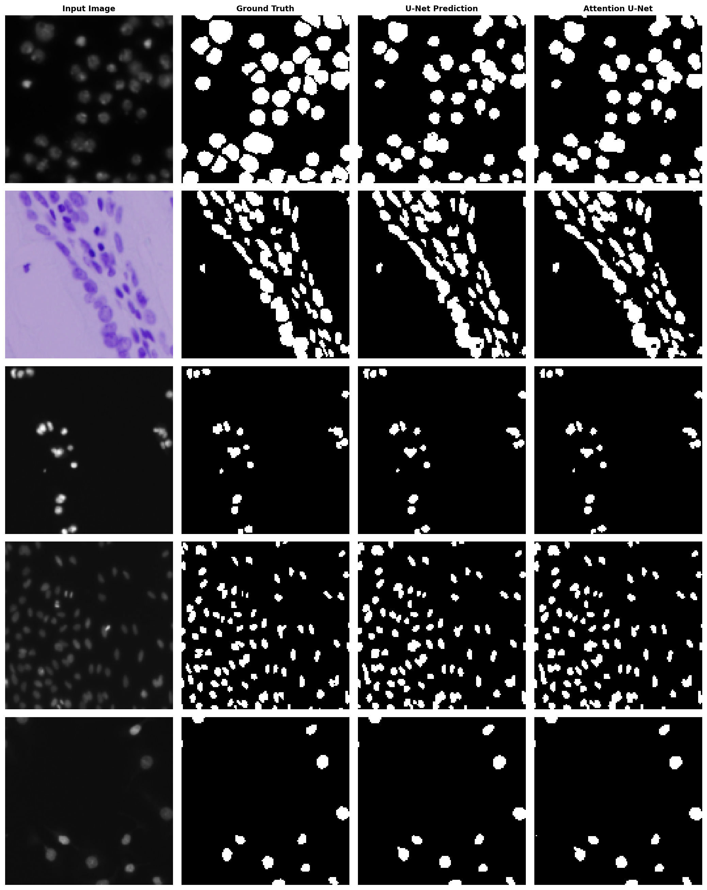
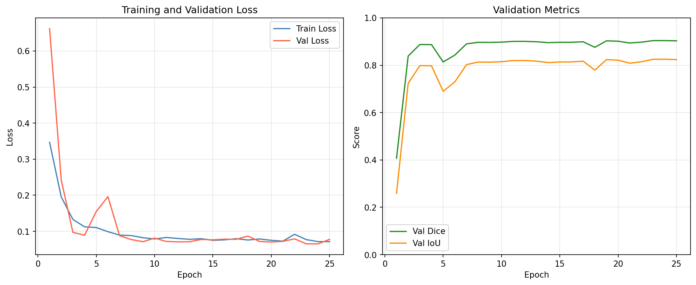
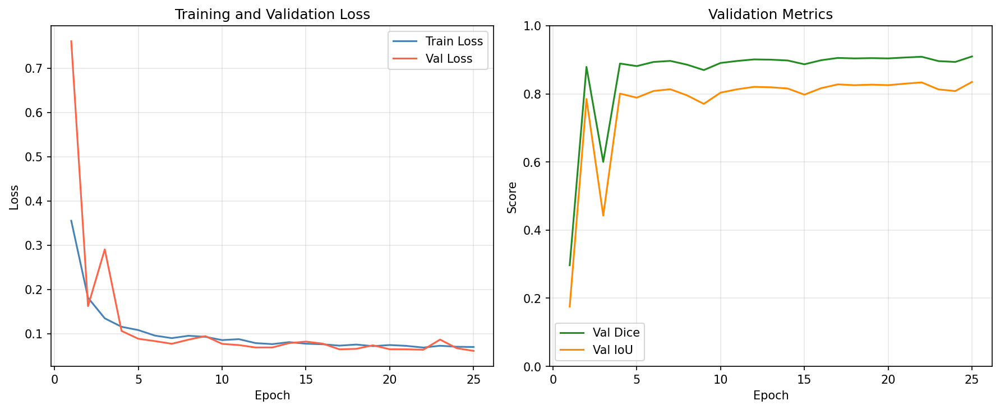
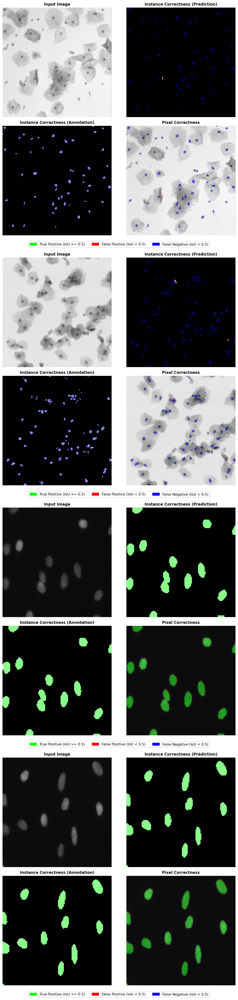
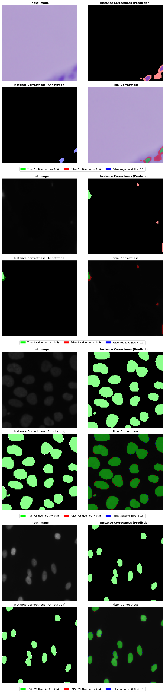

# Medical Image Segmentation with Attention U-Net

Semantic and instance-level cell nuclei segmentation using standard U-Net and Attention U-Net, trained on the 2018 Data Science Bowl dataset.

[](https://www.python.org/)
[](https://pytorch.org/)
[](LICENSE)
[](https://huggingface.co/spaces/aylat7/nuclei-segmentation-ML)

---

## Live Demo

**[Try it on Hugging Face Spaces](https://huggingface.co/spaces/aylat7/nuclei-segmentation-ML)**

Upload any microscopy image to get an instant segmentation overlay. The app highlights detected nuclei in green and, if you provide a ground truth mask, shows a four-panel color-coded evaluation with per-nucleus TP/FP/FN breakdown. Switch between U-Net and Attention U-Net checkpoints and toggle watershed post-processing to compare outputs side by side. 

** There are four built-in sample image pairs (spanning few nuclei, dark background, light background, and dense clusters) are available as one-click examples. They are located below the "Run Segmentation" button!

---

## Results

### Model Comparison



*Each row shows the same validation image segmented by both models. Attention U-Net produces tighter pixel boundaries; standard U-Net separates touching nuclei more reliably.*

### Training Curves

| U-Net | Attention U-Net |
|-------|-----------------|
|  |  |

### Evaluation Panels (TP/FP/FN overlays)

| U-Net | Attention U-Net |
|-------|-----------------|
|  |  |

*Green = True Positive, Red = False Positive, Blue = False Negative. See the Architecture section for a full explanation of the color coding.*

### Metrics (25 epochs, Data Science Bowl 2018)

| Metric | U-Net | Attention U-Net |
|---|---|---|
| Best Dice | 0.9042 | **0.9099** |
| Best IoU | 0.8255 | **0.8351** |
| Instance Precision | **0.8376** | 0.7912 |
| Instance Recall | **0.8306** | 0.7813 |
| Instance F1 | **0.8323** | 0.7802 |

### Key Findings

Attention U-Net wins on pixel-level metrics (Dice +0.006, IoU +0.010), meaning its predicted masks have more accurate boundaries against the ground truth. However, standard U-Net achieves a higher instance-level F1 (0.8323 vs 0.7802) without post-processing. The explanation: attention gates concentrate the model on foreground regions globally, which sharpens boundary pixels, but the same global focus can cause the decoder to merge adjacent touching nuclei into a single connected blob. Standard U-Net propagates more spatially local skip features, which helps it preserve the separation between closely packed cells.

**Watershed post-processing** (`Use watershed post-processing` checkbox in the demo, default on) addresses this directly. By running a distance-transform watershed on the predicted binary mask, touching nuclei that were merged into one connected component by the model are separated into individual instances before evaluation. This improves instance-level metrics for both models, especially Attention U-Net, narrowing the instance-F1 gap without any retraining.

---

## Architecture

### U-Net Encoder-Decoder

```
Input (B, 3, 128, 128)
         |
   ┌─────▼─────┐
   │DoubleConv │──── skip_1 (64 ch) ────────────────────────────────────────┐
   └─────┬─────┘                                                             │
      MaxPool2d                                                              │
   ┌─────▼─────┐                                                             │
   │DoubleConv │──── skip_2 (128 ch) ───────────────────────────────┐        │
   └─────┬─────┘                                                    │        │
      MaxPool2d                                                     │        │
   ┌─────▼─────┐                                                    │        │
   │DoubleConv │──── skip_3 (256 ch) ────────────────────┐          │        │
   └─────┬─────┘                                         │          │        │
      MaxPool2d                                          │          │        │
   ┌─────▼─────┐                                         │          │        │
   │DoubleConv │──── skip_4 (512 ch) ─────────┐          │          │        │
   └─────┬─────┘                              │          │          │        │
      MaxPool2d                               │          │          │        │
   ┌─────▼─────┐                              │          │          │        │
   │Bottleneck │  (1024 ch)                   │          │          │        │
   └─────┬─────┘                              │          │          │        │
   ConvTranspose2d ◄────────────── skip_4 ────┘          │          │        │
   ┌─────▼─────┐                                         │          │        │
   │DoubleConv │  (512 ch)                               │          │        │
   └─────┬─────┘                                         │          │        │
   ConvTranspose2d ◄────────────── skip_3 ───────────────┘          │        │
   ┌─────▼─────┐                                                    │        │
   │DoubleConv │  (256 ch)                                          │        │
   └─────┬─────┘                                                    │        │
   ConvTranspose2d ◄────────────── skip_2 ───────────────────────────┘        │
   ┌─────▼─────┐                                                              │
   │DoubleConv │  (128 ch)                                                    │
   └─────┬─────┘                                                              │
   ConvTranspose2d ◄────────────── skip_1 ────────────────────────────────────┘
   ┌─────▼─────┐
   │DoubleConv │  (64 ch)
   └─────┬─────┘
     Conv2d 1×1
         |
Output (B, 1, 128, 128)  [raw logits, apply sigmoid for probabilities]
```

Each `DoubleConv` block applies: `Conv2d(3×3) -> BatchNorm2d -> ReLU` twice in sequence. The encoder halves spatial resolution at each level while doubling feature channels. Skip connections concatenate encoder features into the decoder, recovering spatial detail lost during pooling.

### Attention Gates (Attention U-Net)

In Attention U-Net, each skip connection passes through an `AttentionGate` before being concatenated in the decoder:

```
Gating signal g (decoder) ──► W_g: Conv2d(1×1) ──┐
                                                   ├──► ReLU ──► psi: Conv2d(1×1) ──► Sigmoid ──► alpha
Skip connection x (encoder) ──► W_x: Conv2d(1×1) ──┘

Output = x * alpha   (element-wise spatial weighting)
```

`alpha` is a spatial map in [0, 1] that suppresses irrelevant background regions before the skip features reach the decoder. The gate learns to focus attention on nuclei rather than staining artifacts, which tightens predicted boundaries without adding significant inference cost.

### Evaluation Color Coding

The four-panel evaluation figures use three colors to show where the model is right and wrong at the instance level (each connected blob = one nucleus):

| Color | Meaning | Condition |
|---|---|---|
| Green | True Positive | Predicted nucleus overlaps a real nucleus at IoU >= 0.5 |
| Red | False Positive | Predicted nucleus has no matching real nucleus |
| Blue | False Negative | Real nucleus was not detected by the model |

---

## Project Structure

```
medical-segmentation/
├── configs/
│   └── config.yaml              # All hyperparameters in one place
├── src/
│   ├── model.py                 # Standard U-Net
│   ├── attention_unet.py        # Attention U-Net + AttentionGate module
│   ├── dataset.py               # NucleiDataset: loads and combines individual masks
│   ├── train.py                 # Training loop, validation, checkpointing
│   ├── evaluate.py              # Dice, IoU, load_model, prediction plots
│   ├── visualize.py             # Color-coded TP/FP/FN overlays, instance metrics, watershed
│   └── utils.py                 # Config loading, device setup, plot helpers
├── tests/
│   ├── conftest.py              # Synthetic dataset fixture (3 samples, 64x64)
│   ├── test_model.py            # U-Net shape and parameter tests
│   ├── test_attention_unet.py   # Attention gate and architecture tests
│   ├── test_dataset.py          # Dataset loading and mask combining tests
│   ├── test_metrics.py          # Dice and IoU correctness tests
│   ├── test_visualize.py        # Instance matching and overlay tests
│   ├── test_training.py         # Integration: loss reduction and checkpointing
│   └── test_load_model.py       # load_model architecture dispatch tests
├── hf_space/                    # Self-contained Hugging Face Spaces deployment
│   ├── app.py
│   ├── src/
│   ├── configs/
│   └── outputs/                 # Trained weights (tracked via Git LFS on HF)
├── outputs/                     # Generated at runtime
│   ├── best_unet.pth            # (gitignored, not pushed to GitHub)
│   ├── best_attention_unet.pth  # (gitignored, not pushed to GitHub)
│   ├── training_curve_*.png
│   ├── predictions_*.png
│   ├── evaluation_panels_*.png
│   └── comparison.png
├── train_model.py               # Entry point: trains one or both models
├── compare_models.py            # Side-by-side comparison figure and metrics table
├── app.py                       # Gradio demo (local)
├── Dockerfile
├── docker-compose.yaml
└── requirements.txt
```

---

## Quick Start

### 1. Install dependencies

```bash
git clone https://github.com/aylat7/nuclei-segmentation-ML.git
cd nuclei-segmentation-ML
pip install -r requirements.txt
```

### 2. Download the dataset

Download the [2018 Data Science Bowl](https://www.kaggle.com/c/data-science-bowl-2018/data) `stage1_train.zip` and extract it so the structure looks like:

```
data/
└── stage1_train/
    └── <sample_id>/
        ├── images/   # one PNG per sample
        └── masks/    # one PNG per nucleus
```

### 3. Train

```bash
# Train both models (25 epochs each, saves best checkpoints to outputs/)
python train_model.py

# Train a single model
python train_model.py --model unet
python train_model.py --model attention_unet
```

### 4. Compare architectures

```bash
python compare_models.py
# Prints metrics table and saves outputs/comparison.png
```

### 5. Run the demo

```bash
python app.py
# Opens at http://localhost:7860
```

### Docker

```bash
# Build image
docker compose build

# Train (output files written to outputs/ via volume mount)
docker compose run train

# Serve the demo at localhost:7860
docker compose up demo
```

GPU training: uncomment the `deploy.resources.reservations` block in `docker-compose.yaml`.

---

## Tech Stack

| Layer | Technology |
|---|---|
| Deep learning | PyTorch 2.0+, torchvision |
| Instance segmentation | scipy (connected components), scikit-image (watershed) |
| Demo UI | Gradio 4.x |
| Visualization | matplotlib, Pillow, NumPy |
| Configuration | PyYAML |
| Progress bars | tqdm |
| Containerization | Docker, Docker Compose |
| Testing | pytest |

---

## Testing

```bash
pytest tests/ -v
```

The suite contains **58 tests** across 7 modules:

| Module | What it covers |
|---|---|
| `test_model.py` | U-Net output shapes (128, 64, 256), batch size 1, parameter count ~31M |
| `test_attention_unet.py` | AttentionGate shapes with mismatched spatial dims, more params than U-Net |
| `test_dataset.py` | Image/mask shapes, binary mask values, mask combining from individual files |
| `test_metrics.py` | Dice and IoU: perfect overlap, no overlap, hand-calculated known values |
| `test_visualize.py` | Instance extraction, greedy matching (TP/FP/FN), overlay dtype and shape, nucleus counting, watershed separation of touching blobs |
| `test_training.py` | Loss decreases over epochs, checkpoint saved, history dict keys |
| `test_load_model.py` | `load_model` dispatches to correct architecture, rejects mismatched weights |

---

## Author

**Ayla Topuz**
[github.com/aylat7](https://github.com/aylat7)
